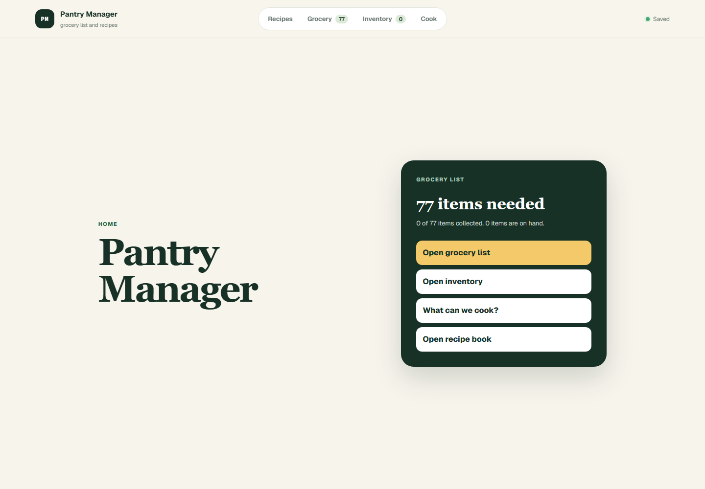
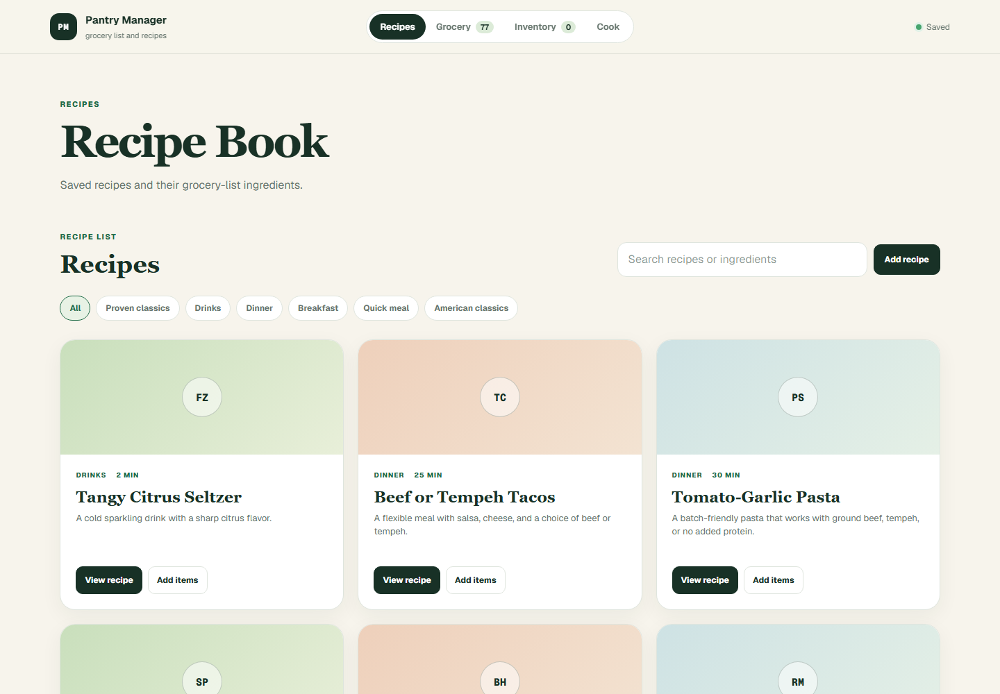
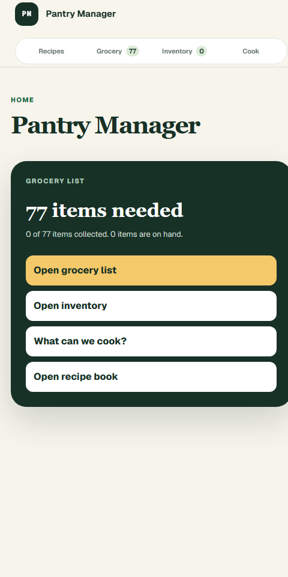
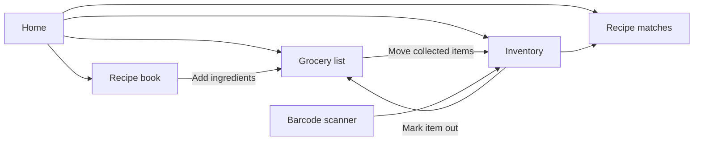

# Pantry Manager

Pantry Manager combines a grocery list, kitchen inventory, recipe book, and inventory-based recipe matching in one responsive web application.

## Screenshots

### Home



### Recipe book



### Phone layout

<p align="center">
  
</p>

## Features

- Grocery list grouped by shopping trip and category
- Weekend, midweek top-up, and long-term staple groups
- Needed, collected, and all-item filters
- On-hand inventory tracking
- Recipe matching based on available ingredients
- Searchable recipe book and user-created recipes
- One-click addition of recipe ingredients to the grocery list
- Continuous barcode scanning for rapid inventory entry
- Open Food Facts product lookup with manual fallback
- Browser and Android Back/Forward navigation
- Installable progressive web app
- Synchronized storage with a local cache for interrupted connections

## Application flow



## Technology

- Next.js and React
- TypeScript
- Vinext and Vite
- Cloudflare Workers and D1
- Drizzle ORM and SQL migrations
- Progressive web app manifest and service worker
- Native `BarcodeDetector` support where available
- Open Food Facts barcode lookup API

## Local development

Requirements:

- Node.js 22.13 or newer
- pnpm

Install dependencies and start the development server:

```bash
pnpm install
pnpm dev
```

Create a production build:

```bash
pnpm build
```

Run lint checks:

```bash
pnpm lint
```

Generate a migration after changing the database schema:

```bash
pnpm db:generate
```

## Authentication and storage

Development mode uses a local preview identity. In production, set `AUTH_USER_ID_HEADER` to the name of a user-ID header supplied by a trusted authentication gateway. The gateway must remove user-provided copies of that header before adding its verified value.

`DEMO_MODE=true` provides a shared sample identity for local production previews. It should not be enabled on an internet-facing deployment.

Grocery and recipe data is stored in a D1 database. A browser cache supports brief offline use and recovery from interrupted connections.

## Project structure

```text
app/
  api/
    barcode/       Open Food Facts lookup
    grocery/       Grocery and inventory persistence
    recipes/       User recipe persistence
  GroceryApp.tsx   Main application UI and client state
  data.ts          Sample items and built-in recipes
  globals.css      Application styles
  manifest.ts      PWA manifest
db/
  index.ts         Database connection
  schema.ts        Drizzle schema
drizzle/           SQL migrations
public/
  icons/           PWA icons
  sw.js            Service worker
docs/images/       README screenshots
```

## Data safety

- Database contents are not stored in the repository.
- `.env` files, credentials, database exports, and user records should not be committed.
- Screenshots should use sample data only.
